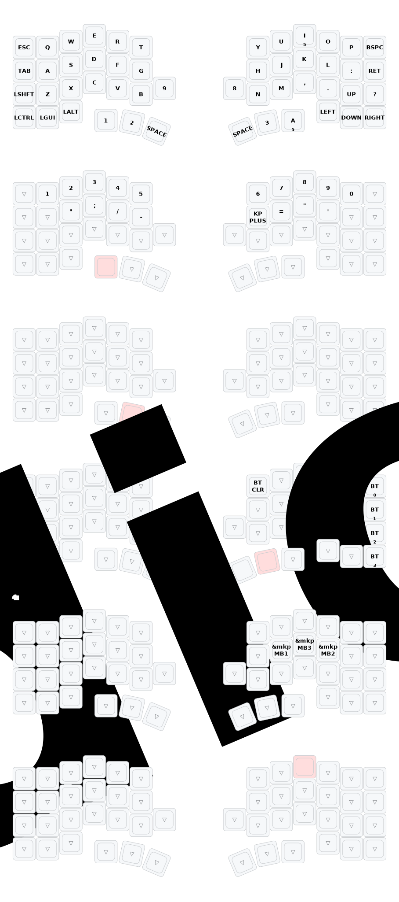

■アップデート履歴

2026/04/17 L側センサーアドレス修正(@75)、L側スクロール出力対応
2026/04/11 ZMK v0.3ブランチ追加、ZMK Studio対応
2026/04/01 [オートマウス誤発動防止](https://github.com/yuchamichami/zmk-config-Corchibi/pull/3)

---

## ファームウェア仕様 - トラックボールセンサー構成

Corchibiは左右それぞれに最大2つのトラックボールセンサー（PAT9125）を搭載でき、合計最大4センサーまで使用可能です。

### センサーアドレスと物理位置

| 位置 | I2Cアドレス | ADピン設定 |
|---|---|---|
| 親指位置 | 0x73 | VCC |
| 人差し指位置 | 0x75 | GNDジャンパ |

### デフォルトの割り当て

| 側 | 位置 | アドレス | 割り当て |
|---|---|---|---|
| **右（セントラル）** | 親指 | @73 | カーソル（メイン） |
| **右（セントラル）** | 人差し指 | @75 | カーソル（スクロールレイヤーでスクロール切替） |
| **左（ペリフェラル）** | 人差し指 | @75 | スクロール |
| **左（ペリフェラル）** | 親指 | @73 | デフォルト無効（オフ） |

### カスタマイズ時の注意事項

- **左側でカーソル操作をしたい場合**：左側をセントラル（USB接続側）に変更することを推奨します。カーソル操作はBLE経由の遅延の影響を受けるため、セントラル側での使用が快適です。
- **センサー競合について**：最大4つのセンサーを同時に使用できますが、動作モードや設定の組み合わせによってセンサー設定が競合する場合があります。ある程度の試行錯誤が必要になることがあります。

---

■関連リンク
[サポートDiscordサーバー](https://discord.gg/nryEcZ6YjU　)
基本的には購入者様向けのサーバーになります、購入検討されている方も興味があればご参加ください。

---
## 今のキーマップ

- [キーマップ画像のカスタマイズはこちら](keymap-drawer/keymap-draw.md)
---

# Corchibi キー配列カスタマイズ手順

※作業にはGitHubアカウントが必要となります。

## Keymap-Editorによるキーマップの編集

1. GitHubにログインし、Corchibiの対象リポジトリをFork（複製）します。
2. ご自身の環境に複製したリポジトリの「Actions」タブを開き、「I understand my workflows, go ahead and enable them」を選択してワークフローを有効化してください。
3. ブラウザから「Keymap-Editor」のウェブサイトを開きます。
4. GitHubアカウントを使用してログインを行い、「Only select repositories」を選んだ上で「Add Repository」ボタンを押します。
5. 再度「Only select repositories」の項目が表示されるため、今度は「Install」を選択して連携を完了させます。
6. 画面上にキーマップが表示され、お好みの配列に編集できるようになります。
7. 編集作業が終わりましたら、画面左上の「Save」を押してください。自動的にビルドが開始され、完了すると「Latest」のリンクからファームウェアのダウンロードが可能になります。

---

## ファームウェアの書き込み方法

ダウンロードしたファームウェアを、以下の流れで本体へ適用します。

1. まず、PCとCorchibiの右側基板をUSBケーブルで接続します。
2. 基板表面に実装されているリセットスイッチを素早く連続で2回押します。するとブートローダーモードに切り替わり、PC側に「XIAO SENSE」という名前のUSBドライブが出現します。
3. 出現した「XIAO SENSE」ドライブの中に、まずはリセット用のファイル `settings_reset-seeeduino_xiao_ble-zmk.uf2` をコピー（またはドラッグ＆ドロップ）して書き込みます。
4. 書き込み後にドライブが一旦消滅しますので、再びリセットスイッチを2回素早く押してブートローダーを再起動させます。続いて、右側用のファームウェア（ `Corchibi_R-seeeduino_xiao_ble-zmk.uf2` など）を書き込んでください。
5. 右側の作業が完了しましたら、左側基板でも全く同じ手順を繰り返します。PCと左側を接続し、 `settings_reset-seeeduino_xiao_ble-zmk.uf2` を適用した後に、左側用のファームウェア（ `Corchibi_L-seeeduino_xiao_ble-zmk.uf2` など）を書き込みます。
6. 両方の基板へのデータ転送が無事に終了したら、左右両方の電源スイッチをオンにし、左右のペアリングをします、左右それぞれのリセットボタンを1回ずつ押してください。
7. 接続先デバイス（PCなど）のBluetooth設定画面から新しいデバイスの検索を行います。「Corchibi」を選択してペアリングが確立されれば、全ての手順は完了です。

### 補足事項・注意点

- ファームウェアの書き込み時、OS側からエラー通知が出ることがありますが、内部的には正常に処理されています。そのまま次の手順へ進んで問題ございません。
- 今後キーマップを変更してファームウェアを更新する際は、PCなど接続先デバイスに登録されているBluetoothのペアリング情報を一度削除してから、再度ペアリングをやり直すようにしてください。
