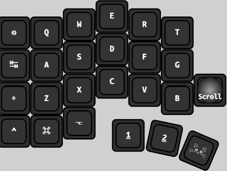
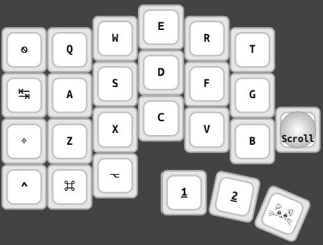
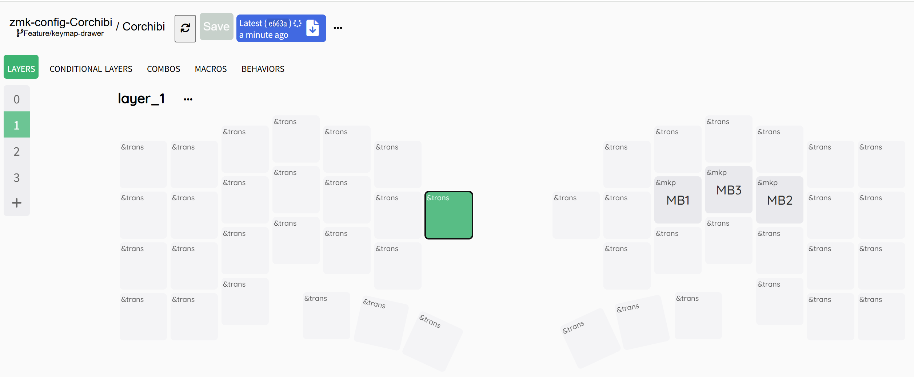
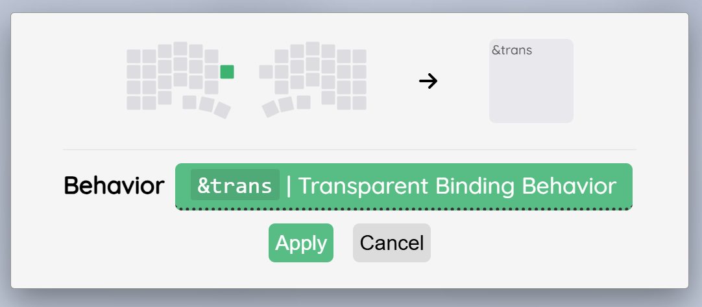
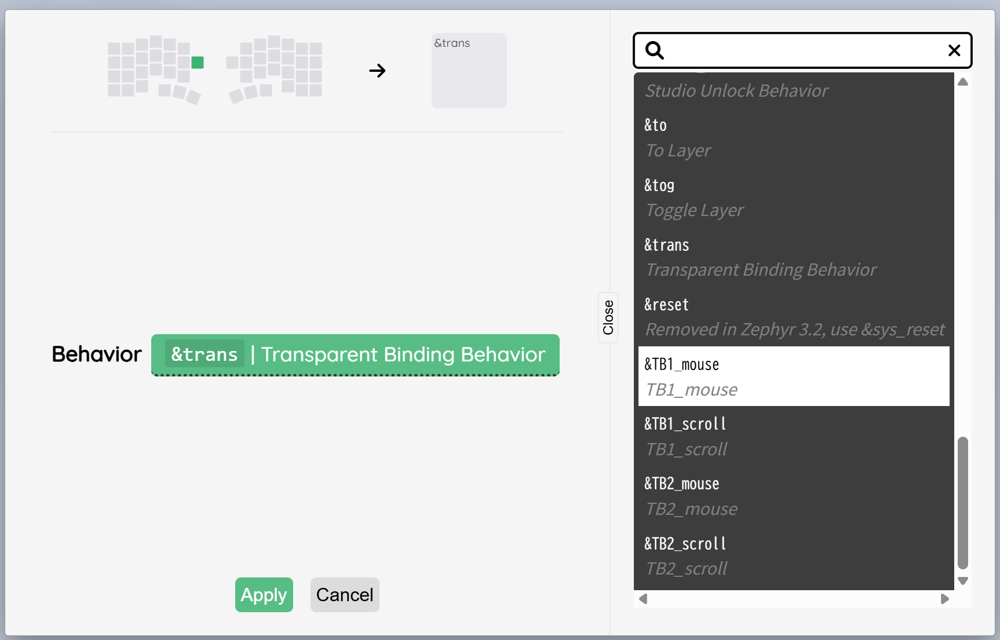
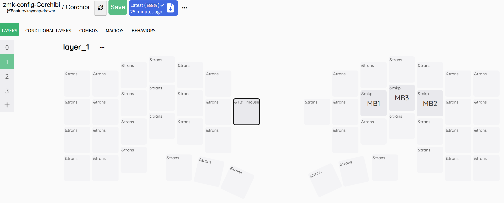
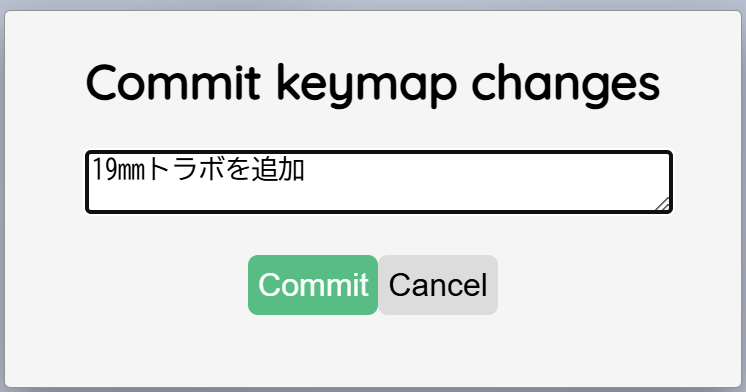
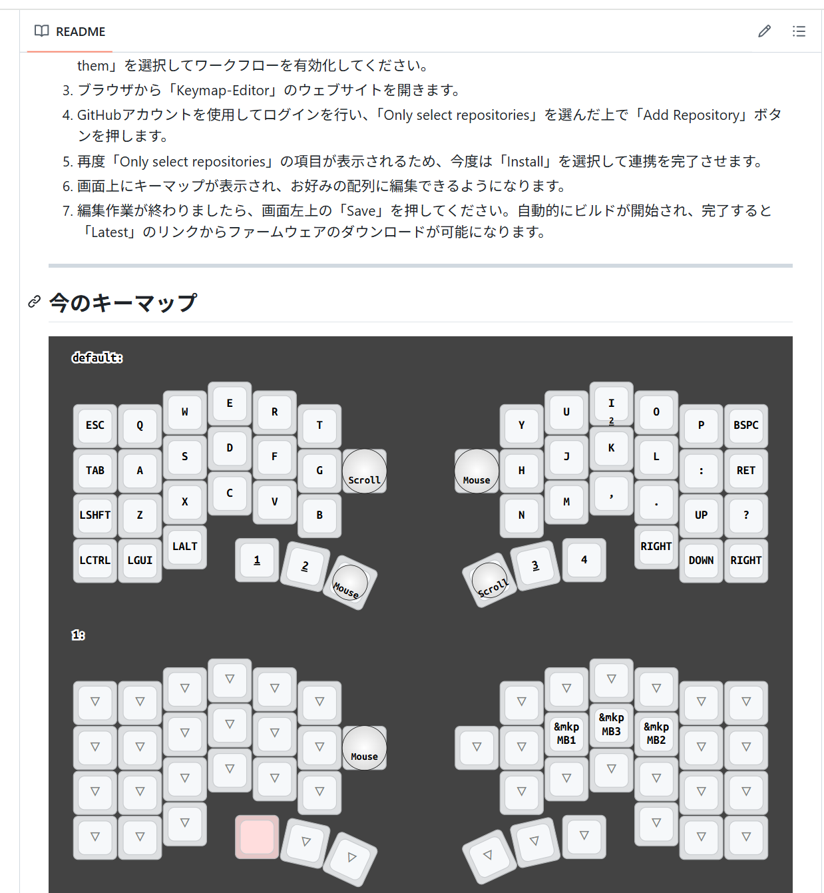

# 自分用のキーマップ画像を描く

トップページ(README.md)のキーマップ画像は[Keymap-drawer](https://github.com/caksoylar/keymap-drawer)を使っています。<br>
jCorchibiのリポジトリは、GitHubのワークフローに描画用ワークフローが設定されているので、<br>
特に気にしなくても[キーマップエディタ](https://nickcoutsos.github.io/keymap-editor/)で編集してSaveすることで、自動的に更新されます。<br>

> [!NOTE]
>カスタマイズ不要であれば描画のためにすることは何もありません。
>キーマップ直編集の方はコミットすればOK<br>
---
## カスタマイズでできること
- 自分の好みの色で描画する  (白、黒のプリセットあり)
- 特定のキー画像を19mmまたは14mmトラボ画像にする

---
## 1. 自分の好みの色で描画する
キーボード本体の色に合わせたカラーテーマを選んだり、カスタマイズしてキーマップ画像を生成できます。

### (1). プリセットの黒または白テーマで描画する場合

| `black` | `white` |
| :---: | :---: |
|  |  |

### テーマの設定方法

リポジトリ内の `keymap-drawer/theme.txt` を開き、使いたいテーマ名に書き換えてコミットします。

```
black
```

または

```
white
```

> [!WARN]
> README.mdに反映されるまでにしばらく時間がかかるケースがあります。<br>
> 体感で5分以上かかってたケースもあるのですが・・ご了承ください。<br>
> keymap-drawer/Corchibi.svgはもう少しだけ早めに更新されるので直接見に行くのも手です。

> [!TIP]
> お試しでテーマを一時的に変えたいとき<br>
> コミットせずに別テーマを試してみることが可能です。<br>
> GitHubの **Actionsタブ** から以下の手順で実行できます。
> 
> 1. リポジトリの **Actions** タブを開く
> 2. 左のワークフロー一覧から **Draw Keymap** を選択
> 3. **Run workflow** ボタンをクリック (ブランチをお間違え無く)
> 4. ドロップダウンからテーマ名を選んで **Run workflow** を実行
>
> ※ この方法は`theme.txt`に反映されず、その1回の描画にのみ適用されます。<br>

---
### (2). オリジナルカラーのテーマを作って描画する場合
[オリジナルテーマを作る方はこちら](https://hindee.github.io/zmk-config-Corchibi/keymap-drawer/theme-builder.html)
> [!NOTE]
> 白または黒テーマを使う方はこのページを使う必要がありません。<br>
> リポジトリ内の keymap-drawer/theme.txtに`black`または`white`を記載しコミットするだけでOK。


---
## 2. トラボを描画したい

今のところCorchibiのトラボ位置をキーマップ画像に自動反映することはできませんが、<br>
KeymapEditor上で専用behaviorを選択していただことで描画することが可能です。

> [!NOTE]
> お手数ですがデフォルトだけでなく、全てのレイヤーで専用behaviorを設定してください。
>`[&trans]`ではトラボ画像になりません。


### (1). キーマップエディタを開く

自分のCorchibiの[キーマップエディタ](https://nickcoutsos.github.io/keymap-editor/)を開いたら、トラボを置きたいキーを選択します。


### (2). Behaviorを選択します。


### (3). メニューから置きたいモジュール用のBehaviorを選びます。

| モジュール | 文字 | behavior |
| :--- | :--- | :--- |
| 19mmトラボ | Mouse | &TB1_mouse |
| 19mmトラボ | Scroll | &TB1_scroll |
| 14mmトラボ | Mouse | &TB2_mouse |
| 14mmトラボ | Scroll | &TB2_scroll |



### (4). Saveしてコミットメッセージを入れてActionタブでワークフローが終わるのを待ちましょう



### (5). 終了するとトップページにREADME.mdが表示されるのでそこに反映されます。

